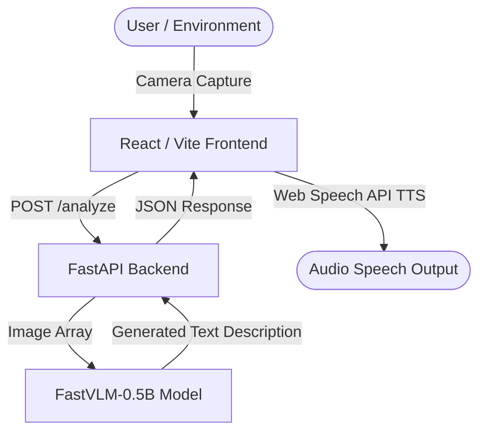

# 👁️ VisuAlize

**VisuAlize** is a modern, privacy-first visual assistance application designed to empower visually impaired individuals. By capturing live camera feeds and leveraging a lightweight, state-of-the-art local Vision-Language Model (VLM), VisuAlize describes the user's environment in real-time and speaks it aloud.

---

## ✨ Key Value Propositions

*   **Accessibility-First Design:** Features a simple, clean, and intuitive interface with built-in Text-to-Speech (TTS) audio feedback, enabling blind or low-vision users to navigate their surroundings.
*   **Privacy & Data Sovereignty:** Powered by a local VLM. No images or environmental data are sent to external cloud APIs, ensuring maximum privacy.
*   **Ultra-Fast Local Inference:** Utilizes Apple's **FastVLM-0.5B**, a highly efficient and lightweight Vision-Language Model optimized for fast response times even on consumer-grade hardware.
*   **NVIDIA GPU Acceleration:** Ready-to-go GPU acceleration configuration via Docker, allowing high-throughput inference with minimal latency.
*   **Seamless Deployment:** Fully containerized architecture using Docker Compose for simple, single-command setup.

---

## 🛠️ System Architecture

VisuAlize is structured as a decoupled web application:



1.  **Frontend (React + Vite):** Streams the user's camera feed, captures frames, manages state, and plays back the descriptive text using the browser's native Web Speech API (`SpeechSynthesis`).
2.  **Backend (FastAPI):** A high-performance Python-based API server that receives captured images, pre-processes them, and runs model inference.
3.  **Model Inference Layer (PyTorch & Transformers):** Loads Apple's **FastVLM-0.5B**. If a CUDA-compatible GPU is present, it uses GPU acceleration. If not, it safely falls back to CPU or demo mock mode.

---

## 🚀 Quick Start (Docker)

The recommended way to run VisuAlize is using **Docker Compose**, which sets up both services and configures environment networks automatically.

### Prerequisites
*   [Docker](https://www.docker.com/get-started) & [Docker Compose](https://docs.docker.com/compose/install/)
*   *(Optional)* [NVIDIA Container Toolkit](https://docs.nvidia.com/datacenter/cloud-native/container-toolkit/install-guide.html) (for GPU acceleration)

### Run the App

1.  **Clone the repository:**
    ```bash
    git clone https://github.com/joorgecamacho/visuAlize.git
    cd visuAlize
    ```

2.  **Start the services:**
    ```bash
    docker-compose up --build
    ```

3.  **Access the application:**
    *   **Frontend Web App:** [http://localhost:5173](http://localhost:5173)
    *   **Backend API Docs (Swagger):** [http://localhost:8000/docs](http://localhost:8000/docs)

*Note: The first startup will take longer because Docker needs to build the images and the backend needs to download the model weights (approx. 1GB).*

---

## 💻 Manual Installation (Local Development)

If you prefer to run the components locally without Docker, follow the steps below.

### 1. Backend Setup

1.  Navigate to the backend directory:
    ```bash
    cd backend
    ```

2.  Create and activate a virtual environment:
    ```bash
    python -m venv venv
    
    # On Windows (PowerShell/CMD):
    .\venv\Scripts\activate
    
    # On macOS/Linux:
    source venv/bin/activate
    ```

3.  Install dependencies:
    ```bash
    pip install -r requirements.txt
    ```

4.  Start the FastAPI server:
    ```bash
    uvicorn main:app --reload --host 0.0.0.0 --port 8000
    ```

### 2. Frontend Setup

1.  Navigate to the frontend directory:
    ```bash
    cd frontend
    ```

2.  Install dependencies:
    ```bash
    npm install
    ```

3.  Start the Vite dev server:
    ```bash
    npm run dev
    ```

---

## 📡 API Endpoints

*   **`GET /`**: Health check. Returns `{"message": "VisuAlize Backend is running"}`.
*   **`POST /analyze`**: Upload an image to get a description.
    *   **Request Type:** `multipart/form-data`
    *   **Parameters:** `file` (the image file to analyze)
    *   **Response:** `{"description": "..."}`

---

## ⚙️ Tech Stack

*   **Frontend:** React (JSX), Vite, Axios (API communication), Web Speech API.
*   **Backend:** Python, FastAPI, PyTorch, HuggingFace Transformers, PIL (Pillow).
*   **Deployment:** Docker, Docker Compose, NVIDIA Container Toolkit.

---

## 🛑 Troubleshooting

### 1. Camera Access Errors
Since the browser requires a secure context for `getUserMedia()`, the camera will only work on `localhost` or via `HTTPS`. If you deploy the app to a custom domain, ensure HTTPS is configured.

### 2. GPU Not Detected in Docker
If the backend logs show that CUDA is not available despite having an NVIDIA GPU:
*   Ensure the [NVIDIA Container Toolkit](https://docs.nvidia.com/datacenter/cloud-native/container-toolkit/install-guide.html) is installed and configured in your Docker daemon.
*   Run `docker info | grep Runtimes` to verify `nvidia` is listed.

### 3. Model Downloads Fail
Make sure you have an active internet connection on your first startup. The model is downloaded directly from HuggingFace (`apple/FastVLM-0.5B`). If HuggingFace is blocked or slow, you can pre-cache it in your HuggingFace cache folder.
